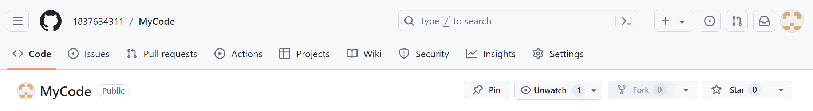
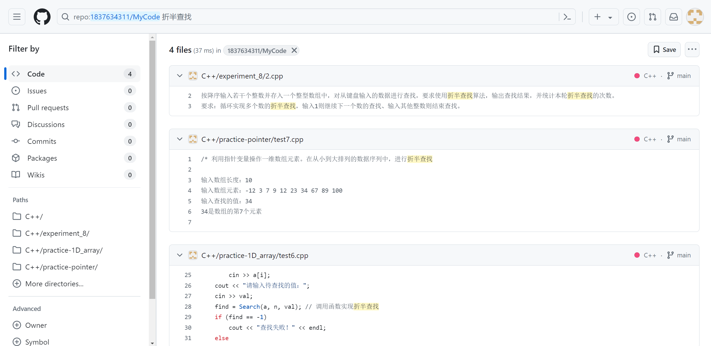

# 《计算机程序设计基础》实验报告答案

**本仓库的《计算机程序设计基础》实验报告对应的课程时间为 2023 ~ 2024 下半学年。**

命名对应着题目，如 `1.cpp` 对应该实验第一题。部分非纯文本题目在文件夹下面的 `.md` 文档中。

本仓库的内容，除了 MFC 编程题，其他都是源代码，需要自己在 VS2010 里面创建项目，然后复制粘贴代码到 VS2010 里面才能运行。

欢迎各位大佬批评指正。

[实验 1](./experiment/experiment_1)
[实验 2](./experiment/experiment_2)
[实验 3](./experiment/experiment_3)
[实验 4](./experiment/experiment_4)
[实验 5](./experiment/experiment_5)
[实验 6](./experiment/experiment_6)
[实验 7](./experiment/experiment_7)
[实验 8](./experiment/experiment_8)
[实验 9](./experiment/experiment_9)
[实验 10](./experiment/experiment_10)
[实验 11](./experiment/experiment_11)
[实验 12](./experiment/experiment_12)
[实验 13](./experiment/experiment_13)

## [测试系统答案](./测试系统答案.md)

## 搜索问题

在 Github 网站的顶端有一个搜索框，可以在这里搜索你想知道的代码，默认是搜索当前仓库的代码。

比如，直接搜索「折半查找」，就可以找到相关代码。

